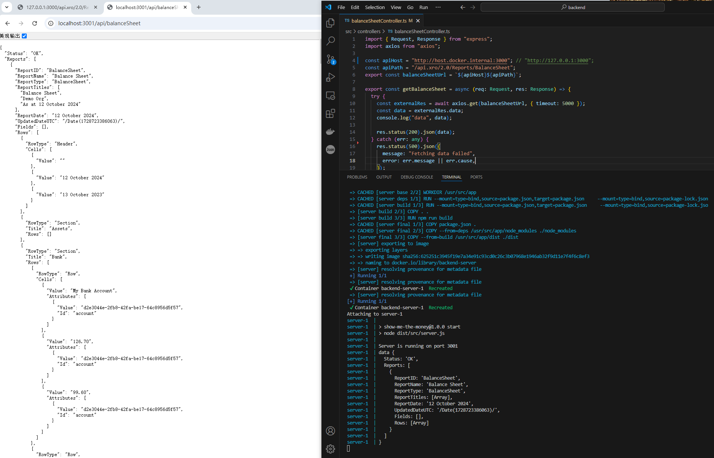
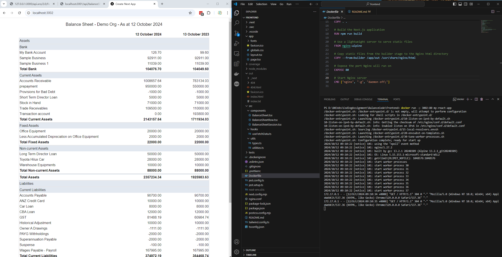

# Backend
## Implemented with Node.js, Express.js, Typescript, Axios, Cors

## Run the backend server in docker container
Execute the command "docker compose up --build" to run the backend server in docker container

## Note: use "http://host.docker.internal:3000" 
do not use "http://localhost:3000" or "http://127.0.0.1:3000"
const apiHost = "http://host.docker.internal:3000"; // "http://localhost:3000" "http://127.0.0.1:3000";

# Frontend
## Run the frontend in docker container
Execute the command "docker build -t my-react-app ." and "docker run -p 3002:80 my-react-app" to run the frontend in docker container

