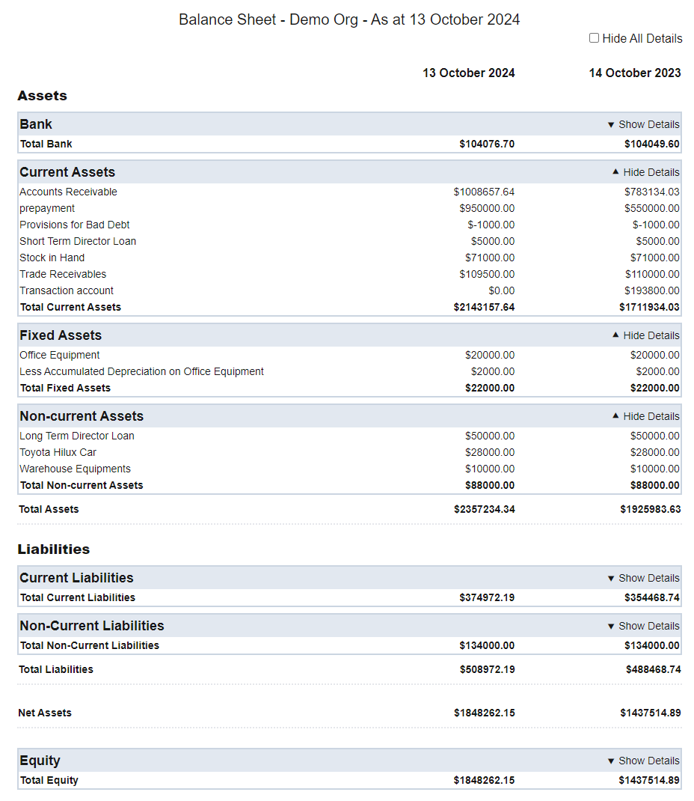
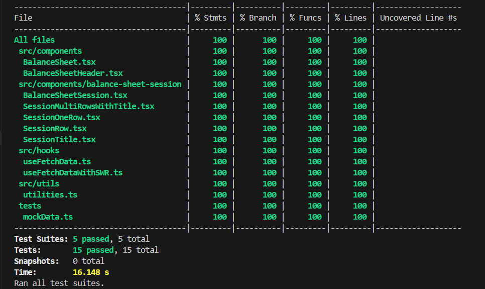
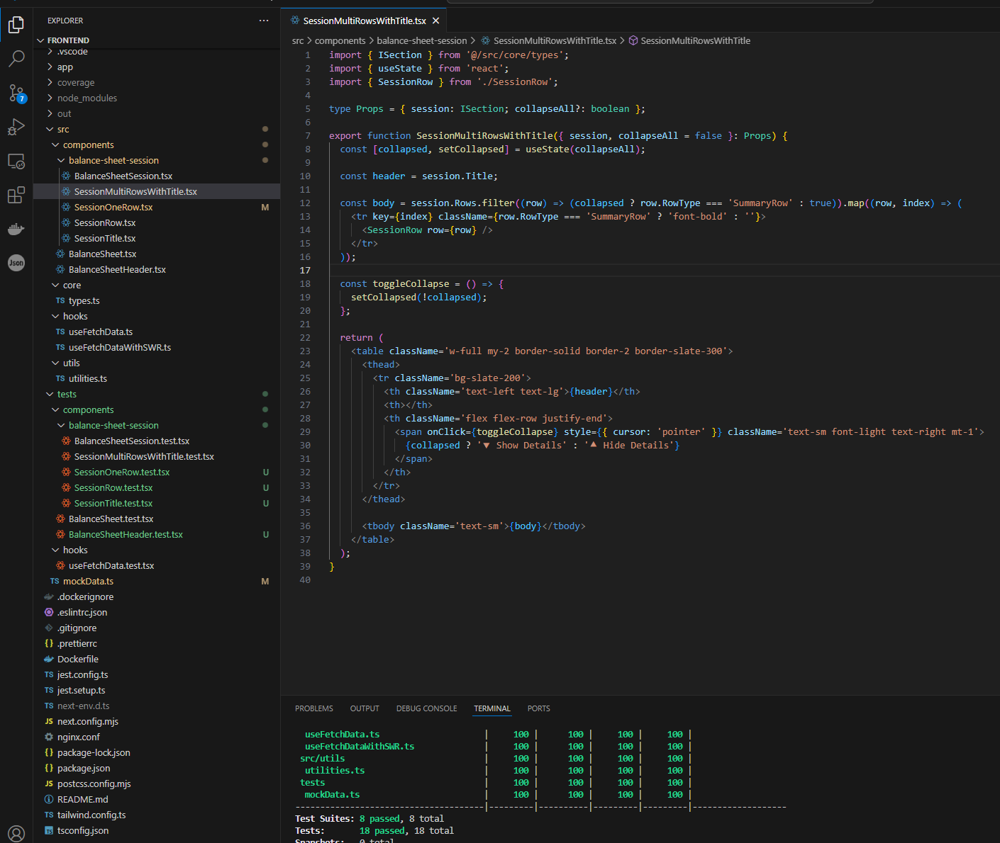

# Backend (port 3001)
## Implemented with Node.js, Express.js, Typescript, Axios, Cors
It includes the following files in the src folder:
* server.ts
* app.ts
* routes.ts
* Controller: balanceSheetController.ts, errorController.ts
* Middleware: globalErrorHandler.ts

## Unit Test using Jest and Supertest
The testing coverage rate is 100%. It includes the following files in the tests folder:
* apiEndpoints.test.ts
    * GET "/api/balanceSheet" should return mock data
    * GET "/api/balanceSheet" should return status code 500 when request failed
    * should handle non-existent routes
* globalErrorHandler.test.ts
    * should handle errors thrown in routes
    * should handle async errors
* mockData.ts


## Backend file structure


## Commands
* run in development: npm run dev
* run in production: npm run build; npm run start
* run unit test cases: npm test
* run in docker container: docker compose up --build

## Containerise the backend in docker container
Execute the command "docker compose up --build" to run the backend server in docker container


## Note: use "http://host.docker.internal:3000" 
do not use "http://localhost:3000" or "http://127.0.0.1:3000". Otherwise the API endpoint cannot get data from the container "jaypeng2015/show-me-the-money".
```
const apiHost = "http://host.docker.internal:3000"; // "http://localhost:3000" "http://127.0.0.1:3000";
```


# Frontend (port 3002)
## Implemented with React 18, Next.js 14, Typescript 5, Tailwind CSS
It includes the following files in the src folder:
* Component: BalanceSheet 
* Component: BalanceSheetRow 
* Component: BalanceSheetSession 
* Hook: useFetchData 
* types.ts and utilities.ts

## Unit Test using Jest and Testing-Library
The testing coverage rate is 100%. It includes the following files in the tests folder:
* BalanceSheet.test.tsx
* BalanceSheetRow.test.tsx
* BalanceSheetSession.test.tsx
* useFetchData.test.tsx
* mockData.ts



## Frontend file structure


## Commands
* run in development: npm run dev
* run in production: npm run build; npm run start
* run unit test cases: npm test
* run in docker container: "docker build -t my-react-app ." and "docker run -p 3002:80 my-react-app"

## Containerise the frontend in docker container
Execute the command "docker build -t my-react-app ." and "docker run -p 3002:80 my-react-app" to run the frontend in docker container
